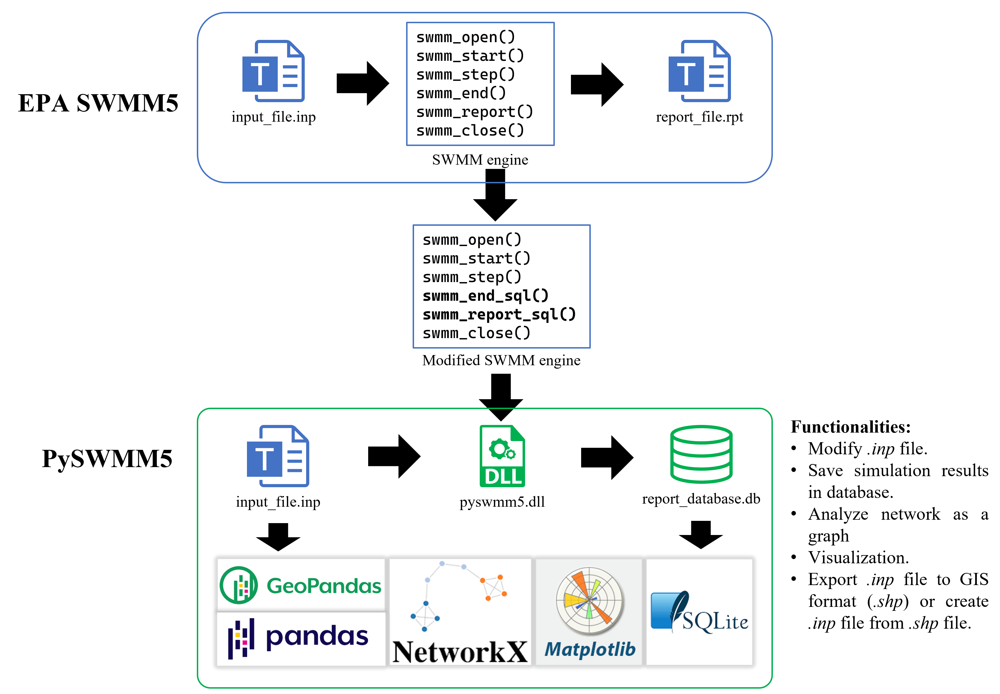

# PySWMM5

This package aims to provide an easy and efficient way to interact with **Storm Water Management Model (SWMM)**, developed by US EPA and widely used in urban stormwater management practices.


Specifically, you can do the following things with the help of this program:

* Modify the data in the **input file (*.inp)**
* Run simulation
* Save simulation results in SQLite database.
* Manipulate input and output data through `DataFrame`.
* Visualize urban drainage systems and design the color, size, and style of any objects.
* Export input file to GIS format (.shp) and create input file from GIS format.

It should be noted that storing results in a database is not only for ease of operation but also **for future consideration**. With the rapid growth of IoT and smart city, the future simulation will involve millions of pipes/nodes, which could result in huge file sizes (in order of gigabytes) and slow I/O operation if we still use text files to store data. To this end, a database like SQLite can perfectly handle these issues. For now, the database generated by `pyswmm5` can save around 50% storage space.

In addition, the database is a good friend of Data Science, which means `pyswmm5` is closely related to Python Data Science packages, especially for packages based on `Pandas`, because most data are stored as the `Pandas DataFrame` type after being loaded into memory.

To take full advantage of this program, **I strongly recommend you use this program in Jupyter Notebook**, which allows you to run your programs in an interactive way. 

# How do we use PySWMM5?

All you need is to move the `pyswmm5`folder into your working directory. Then, you can import it as follow:

```python
import pyswmm5 as ps
```

To read a .inp file:

```python
swmmInp = SwmmInp('swmm.inp')
```

To run simulation:

```python
databaseName = swmmInp.run_swmm('output/', filename='test') # save result in a database
```

To retrieve the simulation results:

```python
swmmRpt = SwmmRpt(databaseName) # all results are stored in swmmRpt
```

**More details can be found in this [tutorial](tutorial.ipynb).**

# How does PySWMM5 work?

The `PySWMM5` is implemented mainly in two steps. In the first step, the source code of SWMM5 was modified to save simulation results in a database (.db) rather than a text file (.rpt). The modified code was built into a dynamic-link library (DLL) that can be used by many programming languages, such as C++, Python, MATLAB, etc. The next step is to utilize Python and useful packages (Pandas, NetworkX, etc.) to wrap this DLL so that we can achieve mentioned functionalities.

